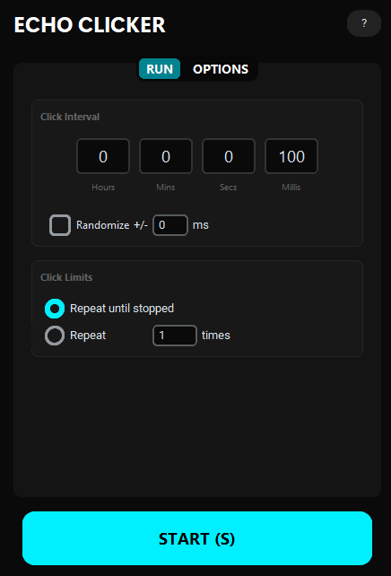
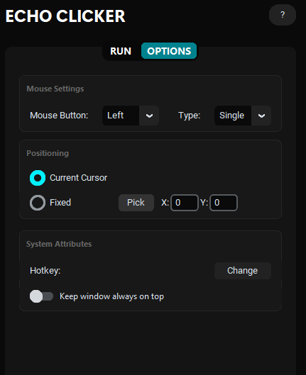

# Echo Clicker

A modern, lightweight, and highly customizable autoclicker application built with Python. Echo Clicker provides precise control over mouse clicking automation with an intuitive dark-themed GUI.

<table>
  <tr>
    <td></td>
    <td></td>
  </tr>
</table>

## Features

### 🎯 Precise Click Control
<details>
<summary>Click configuration options</summary>

- **Customizable Intervals**: Set click intervals from milliseconds to hours with separate inputs for hours, minutes, seconds, and milliseconds
- **Randomization**: Add randomness to your click intervals with configurable +/- ranges to avoid detection patterns
- **Click Types**: Choose between single clicks or double clicks
- **Mouse Buttons**: Support for left, right, and middle mouse button clicks
</details>

### 📍 Smart Positioning
<details>
<summary>Positioning modes and tools</summary>

- **Current Cursor Mode**: Click at the current mouse cursor position
- **Fixed Position Mode**: Set specific X,Y coordinates for consistent clicking
- **Location Picker**: Interactive tool to pick screen coordinates by clicking anywhere on screen
</details>

### 🔄 Advanced Repeat Options
<details>
<summary>Repeat and automation settings</summary>

- **Infinite Mode**: Click continuously until manually stopped
- **Count Mode**: Specify exact number of clicks to perform automatically
</details>

### ⌨️ Hotkey Integration
<details>
<summary>Keyboard shortcuts and controls</summary>

- **Customizable Hotkey**: Set any keyboard key to start/stop clicking instantly
- **Global Hotkey Support**: Works even when the application window is not focused
</details>

### 🎨 Modern User Interface
<details>
<summary>UI features and design</summary>

- **Dark Theme**: Sleek, modern dark interface that's easy on the eyes
- **Always-on-Top**: Option to keep the window always visible above other applications
- **Responsive Design**: Clean, organized tabs for different settings categories
</details>

### 💾 Persistent Settings
- **Auto-Save**: All settings are automatically saved and restored on startup
- **Configuration Management**: JSON-based settings file for reliable persistence

## Run via Python
<details>
<summary>Python setup and installation</summary>

### Prerequisites
- Python 3.7 or higher
- Windows, macOS, or Linux

### Setup
1. Clone or download this repository
2. Navigate to the Source directory
3. Install dependencies:
   ```bash
   pip install -r requirements.txt
   ```
4. Run the application:
   ```bash
   python main.py
   ```
</details>

## Run via Executable
<details>
<summary>Standalone executable (Windows)</summary>

A pre-built executable (`EchoClicker.exe`) is available in the root directory for Windows users who prefer not to install Python.

Simply download and run the executable - no additional setup required!
</details>

## Usage
<details>
<summary>How to use Echo Clicker</summary>

1. **Launch the Application**: Run `main.py` or the executable
2. **Configure Settings**:
   - Set your desired click interval in the RUN tab
   - Choose mouse button and click type
   - Select positioning mode
   - Configure repeat options
3. **Set Hotkey**: Change the start/stop hotkey in the OPTIONS tab if desired
4. **Start Clicking**: Use the START button or press your configured hotkey
5. **Stop**: Click STOP or press the hotkey again
</details>

## Technical Details
<details>
<summary>System architecture and libraries</summary>

- **Backend**: Multi-threaded clicking engine for smooth performance
- **Libraries**: Built with CustomTkinter for UI, Pynput for input control
- **Threading**: Separate threads for GUI and clicking operations
- **Cross-Platform**: Works on Windows, macOS, and Linux
</details>

## Credits

Created by Akmal Riyas
Version 2.1
